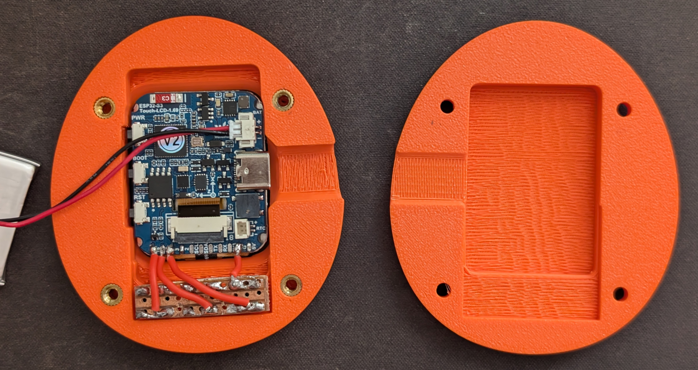

# Tamagrotchi — Bill of Materials & Build Guide

---

## Bill of Materials

| # | Item | Notes | Qty |
|---|------|-------|-----|
| 1 | **Waveshare ESP32-S3-Touch-LCD-1.69** | Main board — includes ST7789V2 display, QMI8658C IMU, PCF85063A RTC, CST816D touch, USB-C charging. Search: `ESP32-S3-Touch-LCD-1.69` | 1 |
| 2 | **LiPo battery** | 3.7 V, 402030 size (4×20×30 mm) fits the case. Any single-cell LiPo with JST-SH 1.25 mm 2-pin connector. ~200–400 mAh recommended. | 1 |
| 3 | **Tactile push buttons** | 6×6 mm or 6×6×5 mm THT momentary switches (3 required: A / B / C). Standard 4-pin PCB type. | 3 |
| 6 | **Jumper wires / ribbon cable** | 2–3 cm, for connecting buttons to the board header. | 4 |
| 7 | **Small perfboard or breadboard** | For mounting the three buttons cleanly | 1 |
| 8 | **M3×8 mm screws** | For closing the case halves. | 4 |
| 9 | **M3 heatset inserts** | Press in to front of case | 4 |
| 10 | **3D-printed case** | Print `hardware/tamagrotchi-face.stl` + `hardware/tamagrotchi-back.stl`. See printing notes below. `button.stl` provides keycaps. | 1 set |
| 11 | **2mm double sided electronic tape** | To afix screen to case and keep printed buttons attached to the tactile buttons | 10cm |

### Optional / Nice to Have

| Item | Purpose |
|---|---|
| Kapton tape | Insulate battery against board back |
| Thin double-sided tape | Secure battery inside case |
| Hot glue | Anchor buttons if they shift |
| JST-SH 1.25 mm 2-pin male plug | If your battery connector doesn't match the board |

---

## GPIO Wiring

The Waveshare board exposes a GPIO header. Wire the external components as follows:

| Signal | GPIO | External Component | Notes |
|--------|------|--------------------|-------|
| Button A | GPIO 3 | Tactile switch → GND | INPUT_PULLUP, active-LOW |
| Button B | GPIO 17 | Tactile switch → GND | INPUT_PULLUP, active-LOW |
| Button C | GPIO 18 | Tactile switch → GND | INPUT_PULLUP, active-LOW |
| Battery | JST-SH on board | LiPo + / − | Board has onboard charging IC |

All on-board peripherals (display, IMU, RTC, touch, buzzer) are already wired internally — no extra connections needed.

---

## 3D Printing

Files are in `hardware/`:

| File | Part |
|---|---|
| `tamagrotchi-face.stl` | Front shell (display window + button holes) |
| `tamagrotchi-back.stl` | Back shell (battery compartment) |
| `button.stl` | Optional button keycaps |
| `tamagrotchi.3mf` | Combined project file (Bambu/PrusaSlicer) |
| `tamagrotchi.f3z` | Fusion project file with all case designs |

### Print Settings

I printed the original case using a Bambu X1 carbon but they aren't difficult prints. 
I would love to see a resin version!

| Setting | Recommended |
|---|---|
| Material | PLA or PETG |
| Layer height | 0.15–0.2 mm |
| Infill | 20% |
| Adaptive layer height | if available! |
| Supports | yes |
| Orientation | Flat for the front shell; reverse down for the back |

---

## Assembly Steps

### 1 — Print the case
Print both shells. Clean up any stringing around the button holes and display window.

### 2 - Place heat set inserts
Use a soldering iron to push the heatset inserts in to the rear of the front case half

### 3 — Flash firmware first
Before assembling, flash the firmware and filesystem image with the board connected via USB-C, and verify the display and OTLP telemetry work:
```bash
pio run --target upload
pio run --target uploadfs
pio device monitor
```

### 4 — Prepare the buttons
Solder three tactile switches to a small piece of perfboard. Run a common GND wire and individual signal wires for GPIO 3, 17, 18.

### 5 - Apply tape to edges of screen
Use the double sided 2mm electronic tape and apply it to the rear of the screen.

### 6 — Seat the board in the front shell
The display is pushed in from the front of the case. The board sits against the front shell with the USB-C port accessible from the edge.
Feed the button board through the front window and then push the screen in to place 

### 7 — Fit the battery
Place the LiPo in the back shell. Stick a layer of Kapton tape over the face of the battery that will rest against the board. Connect the JST-SH plug to the board.
PLEASE check the polarity. This is not a standard connector

### 8 — Close and screw
Bring the two shells together, thread M3 screws through the back into the front shell posts.



---

## Power Notes

- The board's onboard charging IC charges the LiPo via USB-C. No separate charger needed.
- `PIN_SYS_EN` (GPIO 41) must be driven HIGH in firmware to keep the board on after the USB cable is removed — this is handled automatically in `main.cpp`.
- Battery percentage is read from a hardware 200 kΩ / 100 kΩ voltage divider on GPIO 1 (`BAT_DIVIDER_RATIO = 3.0`). The reported range maps 3.0 V → 0 %, 4.2 V → 100 %.
- **Note that the polarity on the board and batteries is not standardised. I had to depin and repin the battery connector before attaching**
---

## Total Cost Estimate

| Item | Approx. cost |
|---|---|
| Waveshare ESP32-S3-Touch-LCD-1.69 | ~$20–25 USD |
| LiPo battery (402030) | ~$3–5 USD |
| Buttons, buzzer, resistor, wires | ~$2–3 USD |
| 3D print filament | ~$0.50 USD |
| **Total** | **~$25–35 USD** |
